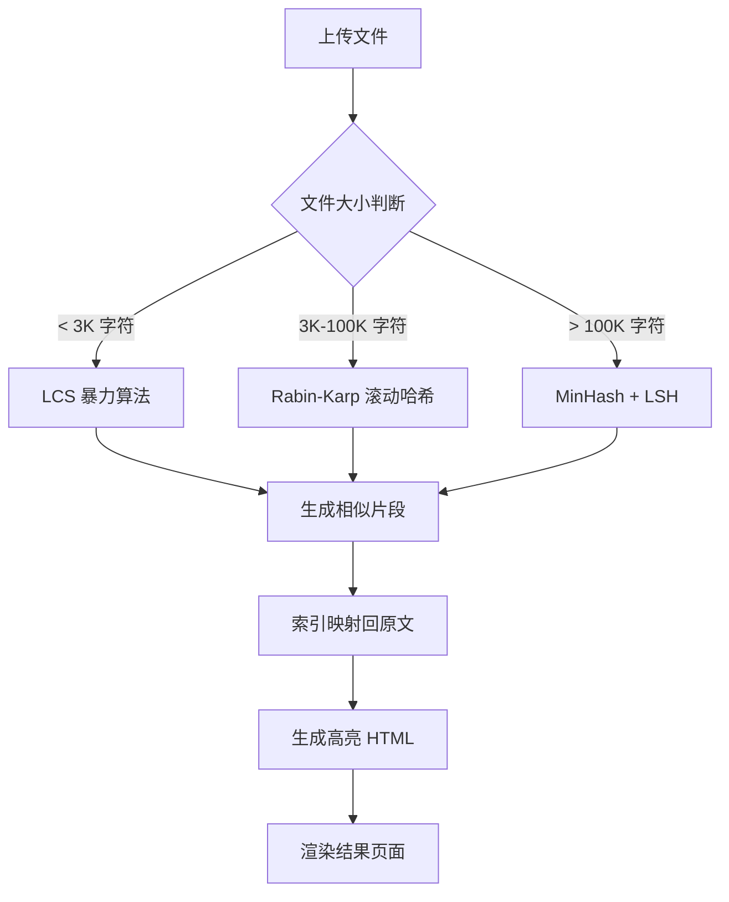

# 文件对对碰 - 专业文档对比工具

<p align="center">
  <strong>🎯 精准识别文档差异 · 💡 AI辅助智能分析 · 📦 一键打包桌面应用</strong>
</p>

---

## 📖 工具说明

**文件对对碰**是一款基于现代 Web 技术构建的专业文档对比工具，专注于精准识别两个版本文档之间的内容差异、相似片段和结构变更。

### 🌟 核心特性

- **🔍 取证级精确对比**：采用行业领先的文本比对算法，精确识别每一处内容差异
- **✨ 差异高亮展示**：相同内容以金色背景高亮标注，差异内容清晰区分
- **🤖 AI 辅助分析**：集成多种大语言模型，提供智能差异分析和改进建议
- **📊 一键导出报告**：支持导出完整的 Word 格式对比报告，方便存档与分享
- **🖥️ 跨平台桌面应用**：基于 Electron 框架，支持 Windows、macOS、Linux 系统
- **📱 响应式设计**：完美适配桌面端和移动端，随时随地进行文档对比

### 🎯 适用场景

- 合同版本差异检查
- 论文抄袭检测
- 代码变更审查
- 投标文件相似度分析
- 文档内容审计

---

## 🛠️ 技术框架

### 前端技术栈

| 技术 | 版本 | 用途 |
|------|------|------|
| **Vue 3** | ^3.5.24 | 核心前端框架，组合式 API |
| **TypeScript** | ~5.9.3 | 类型安全，提升代码质量 |
| **Vite** | ^7.2.4 | 极速构建工具，热模块替换 |
| **Vue Router** | ^4.6.3 | 客户端路由管理 |
| **Remix Icon** | ^4.7.0 | 矢量图标库 |

### 文档处理库

| 库 | 用途 | 支持格式 |
|---|------|----------|
| **mammoth** | Word 文档解析 | .docx |
| **pdf-parse** | PDF 文档解析 | .pdf |
| **xlsx** | Excel 文档解析 | .xls, .xlsx |
| **docx** | Word 报告生成 | .docx |
| **jszip** | 压缩包处理 | .zip（Office 文件底层） |

### 桌面应用框架

| 技术 | 说明 |
|------|------|
| **Electron** | 跨平台桌面应用框架 |
| **electron-builder** | 应用打包和分发工具 |
| **NSIS** | Windows 安装包生成器 |

---

## 🚀 技术路线

### 1. 架构设计

```
┌─────────────────────────────────────────────────────┐
│                  Electron 主进程                      │
│              (electron-main.js)                       │
├─────────────────────────────────────────────────────┤
│                  渲染进程 (Vue 3)                     │
│  ┌──────────────┐  ┌──────────────┐  ┌───────────┐ │
│  │ FileCompare  │  │PropertyCheck │  │ Settings  │ │
│  │   文件对比    │  │   属性检查    │  │  系统设置  │ │
│  └──────────────┘  └──────────────┘  └───────────┘ │
├─────────────────────────────────────────────────────┤
│                 Composables 层                       │
│  ┌────────────┐ ┌──────────┐ ┌─────────┐ ┌───────┐ │
│  │useFileParser│ │useSettings│ │useAIModel│ │...   │ │
│  └────────────┘ └──────────┘ └─────────┘ └───────┘ │
├─────────────────────────────────────────────────────┤
│                  Utils 工具层                        │
│            textAlgorithms.ts (对比算法)               │
└─────────────────────────────────────────────────────┘
```

### 2. 对比算法流程



### 3. 数据流设计

```
文件上传 → 格式识别 → 文本提取 → 预处理(忽略标点/空格) 
  → 相似度计算 → 匹配片段查找 → 索引映射 → 高亮渲染 
  → 结果展示 → 报告导出
```

### 4. 核心技术点

#### 📝 文本预处理
- 支持忽略大小写、标点符号、空格差异
- 维护预处理索引到原文索引的映射表
- 确保高亮位置准确对应原文本位置

#### 🔎 相似片段查找算法

| 算法 | 适用场景 | 时间复杂度 | 空间复杂度 |
|------|----------|------------|------------|
| **LCS 暴力算法** | 小文件 (< 3K) | O(m×n) | O(min(m,n)) |
| **Rabin-Karp** | 中文件 (3K-100K) | O(m+n) | O(m) |
| **MinHash + LSH** | 大文件 (> 100K) | O(m+n) | O(m+n) |

#### 🎨 高亮显示机制
- 使用 `<span class="highlighted-text">` 标签包裹匹配内容
- 金色背景 + 深红色文字 + 圆角阴影
- 支持多行文本跨行高亮（`box-decoration-break: clone`）
- Vue `v-html` 渲染 + 全局样式确保高亮生效

---

## 📦 打包部署

### 开发环境运行

#### 1. 安装依赖
```bash
npm install
```

#### 2. 启动开发服务器
```bash
# 方式一：Web 开发模式（浏览器访问）
npm run dev
# 访问 http://localhost:5173

# 方式二：Electron 桌面应用模式（推荐）
npm run electron:dev
# 直接启动 Electron 窗口，支持热更新
```

### 生产环境构建

#### 1. 构建前端静态文件
```bash
npm run build
# 输出目录：dist/
```

#### 2. 预览生产版本
```bash
npm run preview
```

### 桌面应用打包

#### Windows 平台

**方式一：使用一键打包脚本（推荐）**
```bash
# 双击运行
build-electron.bat

# 或命令行执行
.\build-electron.bat
```

**方式二：手动命令**
```bash
# 构建 Windows 安装包
npm run electron:build:win

# 输出目录：release/
# 生成文件：
#   - release/win-unpacked/          # 未打包的可执行文件
#   - release/文件对对碰 Setup 1.0.0.exe  # NSIS 安装包
```

#### macOS 平台
```bash
npm run electron:build:mac

# 输出目录：release/
# 生成文件：release/文件对对碰-1.0.0.dmg
```

#### Linux 平台
```bash
npm run electron:build:linux

# 输出目录：release/
# 生成文件：release/文件对对碰-1.0.0.AppImage
```

#### 打包所有平台
```bash
npm run electron:build
```

### 打包配置说明

在 `package.json` 的 `build` 字段中配置：

```json
{
  "build": {
    "appId": "com.filecompare.app",
    "productName": "文件对对碰",
    "directories": {
      "output": "release"
    },
    "win": {
      "target": ["nsis"],
      "icon": "dist/favicon.ico"
    },
    "nsis": {
      "oneClick": false,                    // 禁用一键安装
      "perMachine": true,                   // 为所有用户安装
      "allowToChangeInstallationDirectory": true,  // 允许选择安装目录
      "deleteAppDataOnUninstall": true,     // 卸载时删除数据
      "createDesktopShortcut": true,        // 创建桌面快捷方式
      "createStartMenuShortcut": true,      // 创建开始菜单快捷方式
      "shortcutName": "文件对对碰"          // 快捷方式名称
    }
  }
}
```

### 部署方式

#### 1. Web 部署
```bash
# 构建静态文件
npm run build

# 将 dist/ 目录部署到任意 Web 服务器
# 支持 Nginx、Apache、Node.js 等
```

**Nginx 配置示例：**
```nginx
server {
    listen 80;
    server_name your-domain.com;
    root /path/to/dist;
    index index.html;
    
    location / {
        try_files $uri $uri/ /index.html;
    }
}
```

#### 2. 桌面应用分发
- **Windows**: 分发 `.exe` 安装包或 `win-unpacked` 目录
- **macOS**: 分发 `.dmg` 磁盘映像
- **Linux**: 分发 `.AppImage` 可执行文件

### 环境变量配置

创建 `.env` 文件配置环境变量：

```env
# 开发环境
VITE_API_BASE_URL=http://localhost:3000
VITE_AI_MODEL=gpt-4
VITE_AI_TIMEOUT=30000

# 生产环境
VITE_API_BASE_URL=https://api.your-domain.com
```

---

## 📁 项目结构

```
bid-assistant/
├── 📄 electron-main.js          # Electron 主进程
├── 📄 package.json              # 项目配置和依赖
├── 📄 vite.config.ts            # Vite 构建配置
├── 📄 tsconfig.json             # TypeScript 配置
├── 📄 build-electron.bat        # Windows 打包脚本
├── 📄 ELECTRON-GUIDE.md         # Electron 使用指南
│
├── 📁 src/
│   ├── 📄 main.ts               # 应用入口
│   ├── 📄 App.vue               # 根组件
│   │
│   ├── 📁 components/           # 功能组件
│   │   ├── FileCompare.vue      # 文件对比主组件
│   │   ├── FileCompareResult.vue # 对比结果组件
│   │   ├── PropertyCheck.vue    # 属性检查组件
│   │   ├── PropertyCheckResult.vue # 属性检查结果
│   │   ├── FileUpload.vue       # 文件上传组件
│   │   ├── SystemSettings.vue   # 系统设置组件
│   │   ├── RecentRecords.vue    # 最近记录组件
│   │   └── HardwareInfo.vue     # 硬件信息组件
│   │
│   ├── 📁 composables/          # 组合式函数
│   │   ├── useFileParser.ts     # 文件解析逻辑
│   │   ├── useComparison.ts     # 对比算法调度
│   │   ├── useSettings.ts       # 设置管理
│   │   ├── useRecentRecords.ts  # 记录管理
│   │   ├── useAIModel.ts        # AI 模型集成
│   │   └── useHardwareInfo.ts   # 硬件信息
│   │
│   ├── 📁 utils/                # 工具函数
│   │   └── textAlgorithms.ts    # 核心对比算法
│   │
│   ├── 📁 workers/              # Web Workers
│   │   └── comparison.worker.ts # 对比计算 Worker
│   │
│   └── 📁 router/               # 路由配置
│       └── index.js
│
└── 📁 public/                   # 静态资源
    └── favicon.ico
```

---

## ⚙️ 功能配置

### 对比参数设置

| 参数 | 默认值 | 说明 |
|------|--------|------|
| **最小匹配字数** | 5 | 判定为雷同的最小连续字符数 |
| **相似度阈值** | 75% | 标记为高相似度的最低百分比 |
| **忽略大小写** | ✅ | 对比时忽略大小写差异 |
| **忽略标点符号** | ❌ | 对比时忽略标点符号 |
| **忽略空格** | ✅ | 对比时忽略空格差异 |

### AI 模型配置

支持配置多种 AI 大模型：
- OpenAI GPT-4 / GPT-3.5
- Anthropic Claude
- 通义千问
- 文心一言
- 自定义 API 端点

---

## 🔧 开发指南

### 添加新的文件格式支持

1. 在 `src/composables/useFileParser.ts` 中添加解析逻辑
2. 更新支持的文件格式列表
3. 测试解析性能

### 自定义对比算法

1. 修改 `src/utils/textAlgorithms.ts`
2. 调整预处理逻辑
3. 优化匹配算法性能

### 添加新的 AI 模型

1. 在 `src/composables/useAIModel.ts` 中添加模型配置
2. 更新系统设置中的模型选项
3. 测试 API 调用

---


## 📄 许可证

MIT License

---

